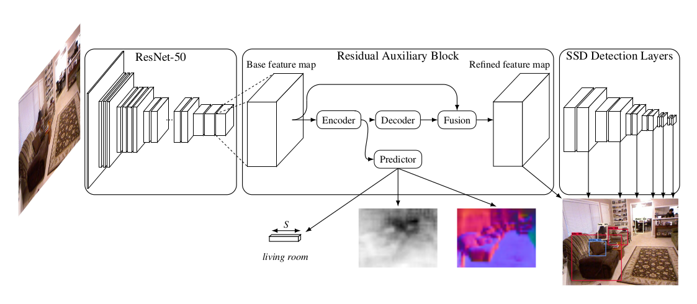
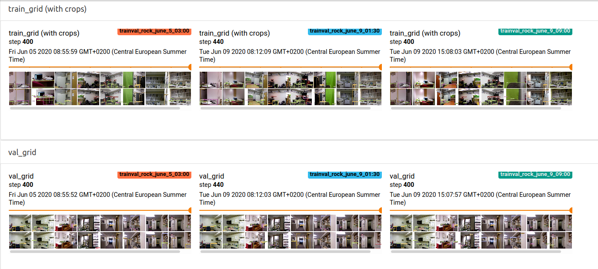
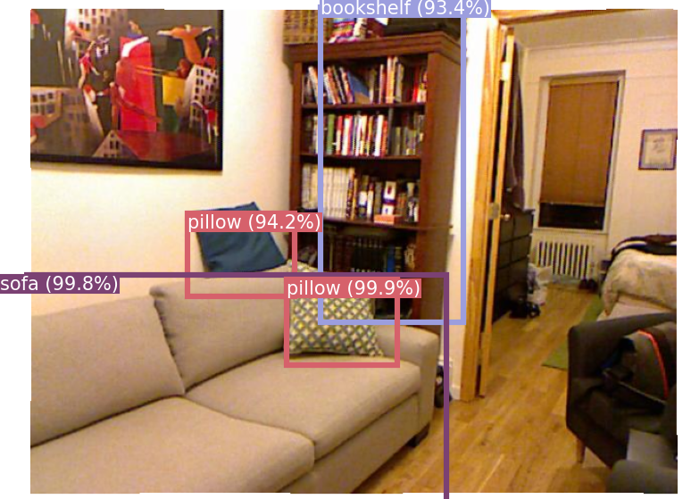
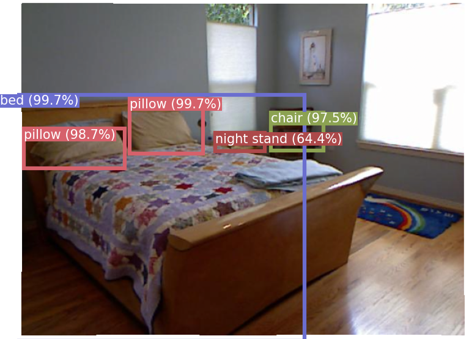
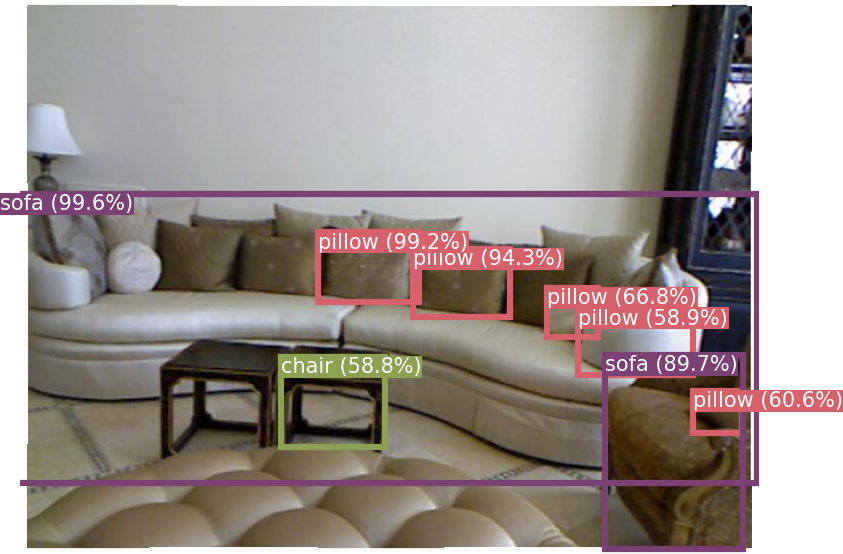
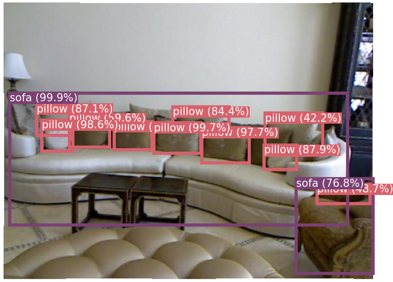
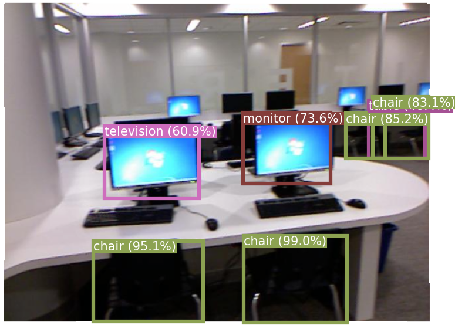
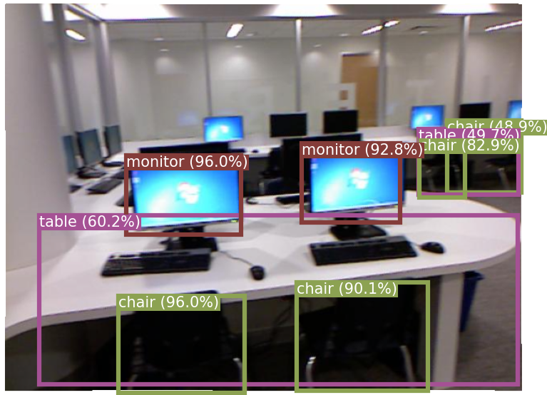
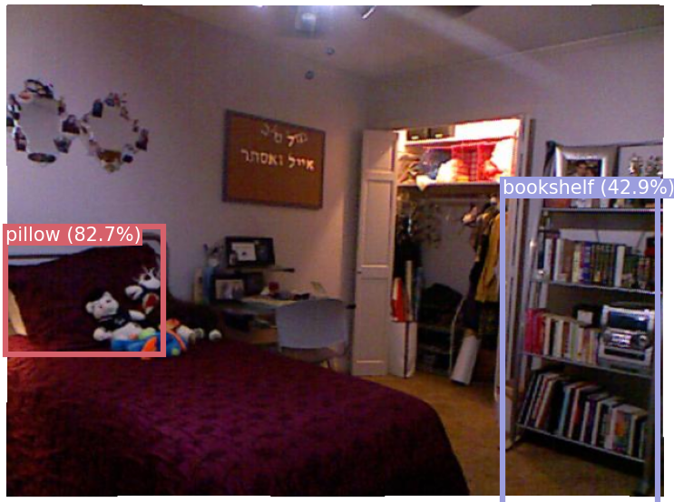
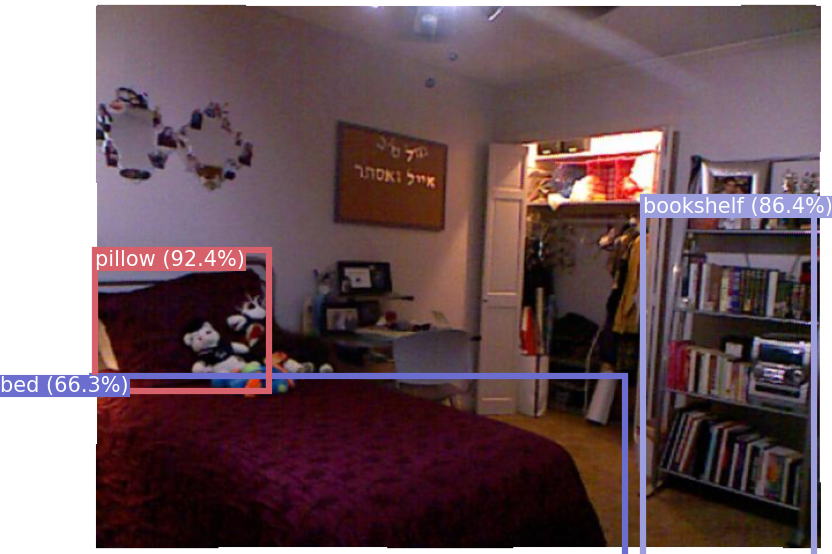

# rock-pytorch


A [PyTorch](https://pytorch.org/) implementation of [ROCK](http://papers.neurips.cc/paper/7406-revisiting-multi-task-learning-with-rock-a-deep-residual-auxiliary-block-for-visual-detection) from the NeurIPS 2018 paper by Taylor Mordan, Nicolas Thome, Gilles Henaff, and Matthieu Cord.

#### Abstract
> Revisiting Multi-Task Learning with ROCK: a Deep Residual Auxiliary Block for Visual Detection
>
>Multi-Task Learning (MTL) is appealing for deep learning regularization. In this
>paper, we tackle a specific MTL context denoted as primary MTL, where the ultimate goal is to
>improve the performance of a given primary task by leveraging
>several other auxiliary tasks. Our main methodological contribution is to introduce
>ROCK, a new generic multi-modal fusion block for deep learning tailored to the
>primary MTL context. ROCK architecture is based on a residual connection, which
>makes forward prediction explicitly impacted by the intermediate auxiliary representations.
>The auxiliary predictor’s architecture is also specifically designed to
>our primary MTL context, by incorporating intensive pooling operators for
>maximizing complementarity of intermediate representations. Extensive experiments
>on NYUv2 dataset (object detection with scene classification, depth prediction,
>and surface normal estimation as auxiliary tasks) validate the relevance of the
>approach and its superiority to flat MTL approaches. Our method outperforms
>state-of-the-art object detection models on NYUv2 dataset by a large margin, and
>is also able to handle large-scale heterogeneous inputs (real and synthetic images)
>with missing annotation modalities.




### Table of Contents
- [Installation](#installation)
- [Interfaces](#interfaces)
- [Preparing the data](#preparing-the-data)
- [Training](#training)
- [Evaluation](#evaluation)
- [Detection](#detection)
- [Changes from paper](#changes-from-paper)
- [Performance](#performance)
- [Project structure](#project-structure)
- [References](#references)
- [Citation](#citation)


## Installation

```
# To clone the repository using HTTPS
git clone https://github.com/vita-epfl/rock-pytorch.git
cd rock-pytorch/
```

This project has been tested with python==3.7 and pytorch==1.5.0. All required packages can be found in the `requirements.txt` file.

<b> Note </b>: the pip and conda versions of `pycocotools` are out-of-date and incompatible with `numpy 1.18` or above. To install an up-to-date version of `pycocotools`, run:
```
pip install cython; pip install -U 'git+https://github.com/cocodataset/cocoapi.git#subdirectory=PythonAPI'
```


### Datasets

The [NYU Depth Dataset V2 dataset](https://cs.nyu.edu/~silberman/datasets/nyu_depth_v2.html) is used to train and evaluate this network.

Download links:
- Dataset containing the images, depths, labels, scenes and instances: http://horatio.cs.nyu.edu/mit/silberman/nyu_depth_v2/nyu_depth_v2_labeled.mat
- Train / test split: http://horatio.cs.nyu.edu/mit/silberman/indoor_seg_sup/splits.mat
- Surface normals and masks: https://cs.nyu.edu/~deigen/dnl/normals_gt.tgz.
- Train / val split: https://github.com/vita-epfl/rock-pytorch/releases/download/v0.1/val_split.txt


#### Download the dataset from the command line:
```
mkdir data
cd data/

wget http://horatio.cs.nyu.edu/mit/silberman/nyu_depth_v2/nyu_depth_v2_labeled.mat

wget http://horatio.cs.nyu.edu/mit/silberman/indoor_seg_sup/splits.mat

wget https://cs.nyu.edu/~deigen/dnl/normals_gt.tgz
tar xzf normals_gt.tgz

wget https://github.com/vita-epfl/rock-pytorch/releases/download/v0.1/val_split.txt

cd ..
```

## Interfaces  

All the commands can be run through a main file called `run.py` using subparsers. To check all the possible commands, run:
- `python3 -m rock.run -h`
- `python3 -m rock.run prep -h`
- `python3 -m rock.run train -h`
- `python3 -m rock.run eval -h`
- `python3 -m rock.run create_image_folder -h`
- `python3 -m rock.run detect -h`

or check the file: `rock/run.py`.

If the datasets are located as indicated in the [project structure](#project-structure), these commands can be run without the need for optional arguments specifying the path.

To train / evaluate / detect images using a baseline SSD, instead of a SSD with the ROCK block, add the `--no_rock` argument to the command.

## Preparing the data

As the NYUv2 dataset does not contain object bounding boxes, some pre-processing is needed to add the bounding boxes, format the data in a suitable way for training and create the training / testing (and optionally validation) sets.
To do so, run:
```
python3 -m rock.run prep
```
with the appropriate optional arguments, if needed.

<b> Note: </b>
The validation set, if added using the `--val_split_path` argument, is extracted from the training set.
It is therefore important to differentiate between the training set obtained without validation data (which contains the training set in its entirety), and the training set obtained with validation data (from which the images of the validation set have been removed), and it is recommended to save these two datasets under different paths.   
An example file structure for the datasets can be found in the [project structure section](#project-structure).


## Training
To train the model, run:

```
python3 -m rock.run train
```
with the appropriate optional arguments, if needed.

The optional arguments can be used to:
  - specify the dataset
  - change the hyper-parameters
  - change the model architecture
  - resume training from a checkpoint
  - specify the model save path and saving conditions
  - specify the evaluation frequency
  - visualize the training with [TensorBoard](https://www.tensorflow.org/tensorboard/)

The default values of hyperparameter arguments are the ones used to obtain the first two results described in the [performance](#performance) section (Baseline SSD and ROCK trained on train set, and evaluated on test set).

Here are some ways in which training can be changed using optional arguments:
#### Model architecture
##### SSD with ROCK
By default, training implements the ROCK block, which is trained on 3 auxiliary tasks: scene, depth and surface normal prediction.  

Any of these auxiliary tasks can be disabled during training using the `--aux_tasks` argument.

##### Baseline SSD
As ROCK is implemented on top of a [Single Shot Detector](https://arxiv.org/abs/1512.02325), this repository can also be used for SSD implementations requiring non-square images.  

To disable the ROCK block altogether and obtain a baseline SSD, use the `--no_rock` argument.


#### Resuming training from a checkpoint
Use the `--checkpoint_path path/to/checkpoint` argument to resume training from a checkpoint.

#### Saving the model

Use the `--save_path path/to/folder` to specify the path in which the model weights will be saved.

By default, the model weights are only saved once training is completed.  
Use the `--save_best_on_val` argument to save the model with the best mAP on the validation data, and the `--model_save_freq num_epochs` argument to save the model every `num_epochs`.

#### Visualization using TensorBoard

If [TensorBoard](https://www.tensorflow.org/tensorboard/) is installed, metrics (such as all training and validation losses, and mAP), as well as training images can be tracked and visualized by adding the optional argument `--writer_path path/to/folder`.

<b>Note:</b>  
To launch Tensorboard, run: `tensorboard --logdir=path/to/logdir`

###### Detections during training using TensorBoard



## Evaluation
To evaluate the model with [COCOeval](http://cocodataset.org/#home) and obtain the mean Average Precision (mAP), run:
```
python3 -m rock.run eval [model_path]
```
with the appropriate optional arguments if needed, and where `[model_path]` is the path to a trained model. Add the `--no_rock` argument if you are evaluating a baseline SSD (without the ROCK block).

The `--show_all_cats` argument can be used to show the mAP per object category.

For evaluation, ground-truth and network output JSON files are created in `data/eval` in a format similar to the ones of the COCO dataset, which are then used by COCOeval to calculate the mAP.

## Detection
To run object detection on a trained model, a folder with images is required:
- run `python3 -m rock.run create_image_folder` with the appropriate optional arguments if needed, to create a folder containing only the images from a pre-processed NYUv2 dataset (created using `rock.run prep`).
- or manually create your own image folder. These images can be of any size, as they get automatically cropped and resized before object detection.

Once an image folder is created, run
```
python3 -m rock.run detect [model_path]
```
with the appropriate optional arguments if needed, and where `[model_path]` is the path to a trained model. Add the `--no_rock` argument if you are running detection using a baseline SSD (without the ROCK block).

The output images are saved in the specified folder (default: `data/detection/output`) with the same names as the input images.

###### Image detection with ROCK
<p float="left">
    
    
</p>

#### Scene, depth and surface normals
When running detection on a model with the ROCK block, the `--scene_output_path`, `--depth_output_path` and `--normals_output_path` arguments can be added to save the scene, depth and surface normal predictions of each image.

#### Throughput
The `--get_throughput` argument can be added to obtain the model throughput (in images/sec). If this argument is added, drawing and saving the output images to a folder are disabled as these operations add a very significant time overhead, and the batch size is set to 1.

## Changes from paper

- Extra convolutional layers were added to each auxiliary task (between the encoder and the predictor), improving their performance (especially for the depth and scene prediction tasks), which in turn improves the mAP compared to a model without these additional convolutional layers.
The convolutional layers added to each auxiliary task are the following:
    * 1x1 convolution from 512 to 256 channels
    * 3x3 convolution from 256 to 256 channels
    * 1x1 convolution from 256 to 512 channels


- Reverse Huber loss (berHu loss) used for depth prediction was changed to a Huber loss. The berHu loss, introduced in this [paper](https://arxiv.org/abs/1606.00373), causes one pixel of the depth prediction to be extremely inaccurate, which is not desirable. This is a consequence of the threshold between linear and quadratic space being set by the maximal per-batch error.

- The weight for the localization loss was changed from 3 to 6 to compensate for the difference in complexity between the classification and localization task, resulting in a slightly improved mAP.

- 5 additional SSD detection layers are added to the refined feature map, instead of 6 in the original paper. Furthermore, the scale of the prior boxes (set by smin and smax) differs from the ones given in the [SSD paper](https://arxiv.org/abs/1512.02325) to accommodate for that change. The prior boxes scale used here is commonly used in other SSD implementations as well.

- A different kind of loss was tested for the classification task. Unlike the confidence loss used in both the original SSD paper and ROCK paper, which only picks the top negative examples when sorted by loss so that the ratio between negatives and positives is at most 3:1, this loss takes into account all negative examples, and weighs them relative to the amount of positive examples in each sample to limit imbalance.  
This loss yields a better mean average precision when trained for the amount of iterations indicated in the paper (21.9% mAP@[0.50:0.95] instead of 19.9% when tested on the validation set).   
It is not active by default, but can be set by adding the `--use_all_priors_conf_loss` argument during training.

## Performance

### NYU Depth v2

#### Performance on test set compared to baseline SSD

Trained on train set (795 images), evaluated on test set (654 images).

Model trained on a NVIDIA RTX 2080 Ti GPU, with:
- `--num_iters 30_000`
- `--lr 5e-5`
- `--scheduler_milestones 25_000`
- `--scheduler_gamma 0.1`


Model           | mAP@[0.50:0.95]   | mAP@[0.50]    | Training time     | Throughput        |
----------------|-------------------|---------------|-------------------|-------------------|
Baseline SSD    | 18.5%             | 35.3%         | <b>2.9 hours</b>  | <b>65.9 FPS</b>   |
ROCK            | <b>20.6%</b>      | <b>39.9%</b>  | 3.3 hours         | 55.8 FPS          |

The weights for these models can be downloaded here:
- [Baseline SSD](https://github.com/vita-epfl/rock-pytorch/releases/download/v0.1/baseline_ssd_trained.pt) (480 MB)
- [ROCK](https://github.com/vita-epfl/rock-pytorch/releases/download/v0.1/rock_trained.pt) (565 MB)


###### Comparison of detected images between the baseline SSD (left) and ROCK (right)
<p float="left">
    
    
</p>

<p float="left">
    
    
</p>

<p float="left">
    
    
</p>


#### Comparison with results from paper
In the paper, the training set was split into a new train / val set.  
Trained on the new train set (673 images), evaluated on val set (122 images), with the same number of iterations and the same learning rate as the model described in the paper.
- `--num_iters 40_000`
- `--lr=5e-5`
- `--scheduler_milestones 30_000`
- `--scheduler_gamma=0.1`


Model         | mAP@[0.50:0.95] | mAP@[0.50]    |
--------------|-----------------|---------------|
Original      | 18.5%           | 37.6%         |
rock-pytorch  | 19.9%           | 36.2%         |


## Project structure

#### Code structure:
```
rock/
├── datasets/
├── model/      # backbone, ROCK block (auxiliary.py), SSD detection layer & losses
├── ssd/        # prior boxes and SSD encoder
├── utils/
└── (+ files for preprocessing, training, evaluating and detection)
```

#### Data structure:
Here is the default way in which files are organized in the data folder (if no optional arguments to change the path are used).  
Using this data structure minimizes the need to use arguments for commands, although the file structure can be modified, and the paths to folders specified using optional arguments for all commands.

```
data/
├── train_test/
│   ├── nyuv2_train/    # 795 images
│   └── nyuv2_test/     # 654 images
├── train_val_test/
│   ├── nyuv2_train/    # 673 images
│   ├── nyuv2_val/      # 122 images
│   └── nyuv2_test/     # 654 images
├── runs/
├── models/
├── detection/
│   ├── images/
│   ├── output/
│   ├── scene_output/
│   ├── depth_output/
│   └── normals_output/
├── tensorboard_images/
├── eval/   # folder containg JSON files for COCOeval
└── (+ extra files and folders containing the raw downloaded data)
```

## References
- Taylor Mordan, et al., ["Revisiting Multi-Task Learning with ROCK: a Deep Residual Auxiliary Block for Visual Detection"](http://papers.neurips.cc/paper/7406-revisiting-multi-task-learning-with-rock-a-deep-residual-auxiliary-block-for-visual-detection), NeurIPS 2018
- Wei Liu, et al., ["SSD: Single Shot MultiBox Detector"](https://arxiv.org/abs/1512.02325), ECCV 2016.
- Kaiming He, et al., ["Deep Residual Learning for Image Recognition"](https://arxiv.org/abs/1512.03385), CVPR 2016
- Nathan Silberman, et al., ["NYU Depth Dataset v2"](https://cs.nyu.edu/~silberman/datasets/nyu_depth_v2.html), ECCV 2012

- The SSD implemented in this project has been heavily influenced by these great SSD implementations:
  * [PyTorch SSD by NVIDIA](https://pytorch.org/hub/nvidia_deeplearningexamples_ssd/)
  * [ssd.pytorch by amdegroot](https://github.com/amdegroot/ssd.pytorch)
  * [SSD by lufficc](https://github.com/lufficc/SSD)
  * [pytorch-ssd by kuangliu](https://github.com/kuangliu/pytorch-ssd)
  * [ssd.DomainAdaptation by chautan-utk](https://github.com/chauhan-utk/ssd.DomainAdaptation)

## Citation
If you use this project in your research, please cite the corresponding paper:
```text
@inproceedings{mordan2018revisiting,
  title={Revisiting Multi-Task Learning with {ROCK}: a Deep Residual Auxiliary Block for Visual Detection},
  author={Mordan, Taylor and Thome, Nicolas and Henaff, Gilles and Cord, Matthieu},
  booktitle={Advances in Neural Information Processing Systems (NeurIPS)},
  pages={1310--1322},
  year={2018}
}
```
This project was made by David Mizrahi at EPFL/VITA.
